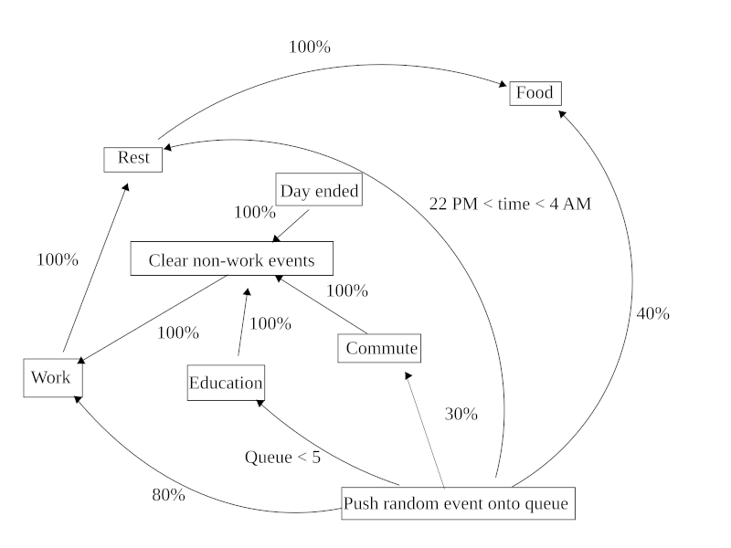

# Automata

This is a lab work on automata theory, specifically finite state machines.

There is nothing special about this, FSMs are really easy if you do them without major mistakes.

The states are as such:
- commute
- work
- rest
- eating
- education

The transitions are mostly random, and all the events are put into an event queue.
Each type of action takes a finite random amount time in a predefined range, different for each action.
After finishing the action, the person moves on to the next one in the queue, and concrete transitions
are implemented by simply pushing the action to the front of the queue before the dequeing takes placeo.

The concrete transitions are as such:
- work -> rest
- rest -> eat
- commute -> work
- finished commute -> put education into queue after next meal
- education -> remove all commutes, rests and meals from queue
- end of day (current time = 24) -> also remove all commutes, rests and meals from queue

Here's the diagram:

